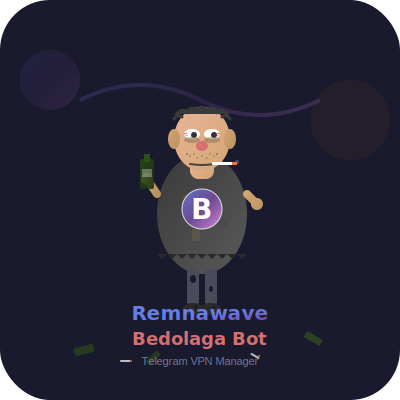

<div align="center">



# BedolagaBan Installer

**Интерактивный установщик BedolagaBan для сервера и VPN-нод**

Установщик разворачивает систему мониторинга VPN-подключений, детекции нарушений,
автобанов, Telegram-управления и сбора аналитики для инфраструктуры на базе
**Remnawave Panel**.

[](https://github.com/remnawave)
[](https://docs.docker.com/compose/)
[](#лицензия)
[](https://github.com/BEDOLAGA-DEV)
[](https://shop.pedze.ru/)

</div>

<div align="center">

Разворачивает центральный сервер BedolagaBan и агентов на VPN-нодах без ручной сборки `.env`.

</div>

<p align="center">
  <a href="#быстрая-установка">Быстрый старт</a> •
  <a href="#примеры-env">Примеры .env</a> •
  <a href="#когда-использовать-panel_secret_key">PANEL_SECRET_KEY</a> •
  <a href="#частые-проблемы">Частые проблемы</a> •
  <a href="#лицензия">Лицензия</a>
</p>

---

## Что получишь после установки

- центральный сервер BedolagaBan с API, аналитикой и Telegram-ботом
- готовый `.env`, собранный интерактивным установщиком
- токен для агентов VPN-нод
- подключение к Remnawave Panel через API токен и при необходимости через `PANEL_SECRET_KEY`
- готовые Docker Compose команды для обновления и обслуживания

---

## Что делает BedolagaBan

BedolagaBan нужен для контроля пользователей VPN и автоматической реакции на
подозрительное поведение.

Система умеет:

- отслеживать подключения с VPN-нод в реальном времени
- определять превышение лимита устройств/IP
- банить пользователей автоматически или вручную
- фиксировать Wi-Fi / mobile / datacenter / ASN признаки
- вести статистику и историю нарушений
- отправлять уведомления и давать управление через Telegram-бота
- работать с Remnawave Panel через API токен и, при необходимости, через `PANEL_SECRET_KEY`

---

## Что ставит этот репозиторий

Установщик разворачивает две части системы.

### 1. Центральный сервер

Сервер BedolagaBan:

- принимает данные от агентов с VPN-нод
- синхронизируется с Remnawave Panel
- считает лимиты, нарушения и наказания
- поднимает HTTP API
- запускает Telegram-бота
- хранит данные в локальной БД или PostgreSQL

Обычно ставится на отдельный сервер управления или на тот же сервер, где уже
крутится панель.

### 2. Агент на VPN-ноде

Агент:

- читает логи Xray/RemnaNode
- собирает подключения пользователей
- отправляет события на центральный сервер

Агент ставится на **каждую VPN-ноду**, которую нужно мониторить.

---

## Для кого этот установщик

Подходит, если ты хочешь:

- быстро развернуть BedolagaBan без ручной сборки `.env`
- подключить систему к существующей Remnawave Panel
- централизованно мониторить несколько VPN-нод
- получить рабочую установку через Docker Compose

---

## Что нужно заранее подготовить

Перед установкой подготовь:

- Linux сервер: Ubuntu 20.04+ / Debian 11+ / совместимый дистрибутив
- Docker и Docker Compose v2
- лицензионный ключ BedolagaBan
- URL твоей Remnawave Panel
- API токен панели
- Telegram bot token от `@BotFather`
- Telegram ID администратора

Если панель закрыта через reverse-proxy/NGINX, дополнительно может понадобиться:

- `PANEL_SECRET_KEY` в формате `cookie_name:cookie_value`
- пример: `UinFiwLL:QHxwyZyP`

---

## Что спрашивает установщик

Во время установки серверного контура скрипт задаёт вопросы и сам формирует `.env`.

Основные блоки:

1. Проверка Docker и системных требований
2. Генерация токенов безопасности
3. Ввод лицензионного ключа
4. Подключение к Remnawave Panel
5. Ввод API токена панели
6. Необязательный `PANEL_SECRET_KEY` для reverse-proxy
7. Настройка Telegram-бота
8. TLS для агентов
9. Система автобанов и аналитика
10. Запуск контейнеров

Если `PANEL_SECRET_KEY` не нужен, просто нажми `Enter` и установка продолжится
по старому сценарию.

---

## Быстрая установка

### Сервер

```bash
bash <(curl -fsSL https://raw.githubusercontent.com/PEDZEO/bedolagaban-install/main/install.sh)
```

После установки сервер обычно оказывается в:

```bash
/opt/banhammer
```

### Агент на VPN-ноде

```bash
bash <(curl -fsSL https://raw.githubusercontent.com/PEDZEO/bedolagaban-install/main/install_agent.sh)
```

После установки агент обычно оказывается в:

```bash
/opt/banhammer-agent
```

---

## Примеры `.env`

Установщик сам создаёт `.env`, но если нужно заранее понять, какие значения
туда попадают, ниже есть готовые примеры.

<details>
<summary>Сервер BedolagaBan: минимальный пример `.env`</summary>

```env
# Токены
API_TOKEN=твой_секретный_токен_минимум_32_символа
AGENT_TOKEN=токен_для_всех_агентов

# Remnawave Panel
PANEL_URL=https://panel.example.com
PANEL_TOKEN=твой_api_токен_панели

# Если панель закрыта через reverse-proxy / nginx cookie:
# PANEL_SECRET_KEY=UinFiwLL:QHxwyZyP

# Telegram
TELEGRAM_BOT_TOKEN=токен_от_botfather
TELEGRAM_ADMIN_IDS=123456789

# TLS для агентов
TLS_ENABLED=true
TLS_DOMAIN=agent.example.com
```

</details>

<details>
<summary>Агент: пример `.env` с TLS через домен</summary>

```env
# Уникальное имя ноды
NODE_NAME=node1

# Этот домен должен указывать именно на сервер BedolagaBan
BANHAMMER_HOST=agent.example.com
BANHAMMER_PORT=9999

# Такой же токен должен быть на сервере
AGENT_TOKEN=токен_для_всех_агентов

# Для домена с TLS
TLS_ENABLED=true

# Папка с логами Xray / RemnaNode
LOG_DIR=/var/log/remnanode
```

</details>

<details>
<summary>Агент: пример `.env` без TLS, по IP</summary>

```env
NODE_NAME=node1

# IP сервера BedolagaBan
BANHAMMER_HOST=1.2.3.4
BANHAMMER_PORT=9999

AGENT_TOKEN=токен_для_всех_агентов

# Без домена TLS нужно отключить
TLS_ENABLED=false

LOG_DIR=/var/log/remnanode
```

</details>

<details>
<summary>Пример `PANEL_SECRET_KEY` для панели за reverse-proxy</summary>

```env
PANEL_URL=https://panel.example.com
PANEL_TOKEN=твой_api_токен_панели
PANEL_SECRET_KEY=UinFiwLL:QHxwyZyP
```

Если у тебя панель закрыта через nginx/reverse-proxy и без cookie API не
открывается, укажи `PANEL_SECRET_KEY` в формате:

```env
cookie_name:cookie_value
```

</details>

---

## Как работает схема целиком

Поток данных выглядит так:

1. Пользователь подключается к VPN-ноду.
2. Агент на ноде читает логи подключений.
3. Агент отправляет события на сервер BedolagaBan.
4. Сервер сопоставляет пользователя с данными из Remnawave Panel.
5. Система считает лимиты, сеть, ASN, историю и другие признаки.
6. При нарушении создаётся бан, уведомление или запись в аналитику.
7. Администратор видит это в Telegram-боте и через API.

---

## Когда использовать `PANEL_SECRET_KEY`

По умолчанию BedolagaBan подключается к панели через:

- `PANEL_URL`
- `PANEL_TOKEN`

Если доступ к панели закрыт через NGINX/reverse-proxy и API без cookie режется,
установщик позволяет сразу сохранить:

```env
PANEL_SECRET_KEY=cookie_name:cookie_value
```

Например:

```env
PANEL_SECRET_KEY=UinFiwLL:QHxwyZyP
```

Это полезно, если панель не отдаёт API без дополнительной cookie-авторизации.

---

## Обновление

### Сервер

```bash
cd /opt/banhammer
docker compose pull
docker compose up -d --force-recreate
```

### Агент

```bash
cd /opt/banhammer-agent
docker compose pull
docker compose up -d --force-recreate
```

---

## Полезные команды

### Сервер

```bash
cd /opt/banhammer
docker compose ps
docker compose logs -f
docker logs -f banhammer-lite
docker logs -f banhammer-bot
```

### Агент

```bash
cd /opt/banhammer-agent
docker compose ps
docker compose logs -f
```

---

## Частые проблемы

### Панель не подключается

Проверь:

- правильный ли `PANEL_URL`
- рабочий ли `PANEL_TOKEN`
- нужен ли `PANEL_SECRET_KEY`
- не режет ли reverse-proxy запросы в API
- не требуется ли внутренний Docker URL вместо публичного домена

### Агент не виден на сервере

Проверь:

- совпадает ли `AGENT_TOKEN` на сервере и ноде
- доступен ли порт `9999/tcp`
- читаются ли логи Xray/RemnaNode
- показывает ли сервер в логах `Node registered`

### install.sh не запускается

Если на Linux видишь ошибку вида:

```text
cannot execute: required file not found
```

исправь окончания строк:

```bash
dos2unix install.sh
chmod +x install.sh
./install.sh
```

или:

```bash
sed -i 's/\r$//' install.sh
chmod +x install.sh
./install.sh
```

---

## Что хранится после установки

После работы установщика у тебя остаются:

- `.env` с конфигурацией
- `docker-compose.yml`
- директории данных проекта
- рабочие контейнеры сервера/бота или агента

Установщик не просто запускает контейнеры, а оставляет понятную структуру для
дальнейшего обслуживания.

---

## Лицензия

Коммерческое ПО. Все права защищены.

Для приобретения лицензии и доступа:

- GitHub организация: [BEDOLAGA-DEV](https://github.com/BEDOLAGA-DEV)
- Сайт оплаты: [shop.pedze.ru](https://shop.pedze.ru/)
- Telegram: [@ban](https://t.me/bedolagaban)
